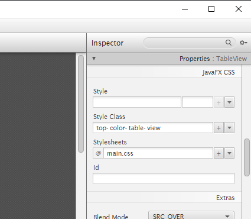
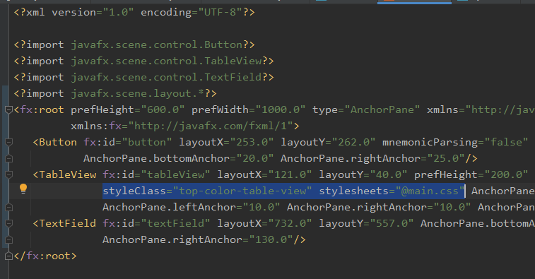

# javafx-css
JavaFX에 CSS를 적용한 심플한 UI 데모

### JavaFX에 CSS 적용 방법

1. FXML 파일에 직접 입력

   1. SceneBuilder를 이용하여 입력

      
      
   2. FXML 파일을 수정하여 입력 (아래의 코드 추가)
   
      

2. 코드 상에서 Load
   1. 현재 클래스와 동일한 위치의 css